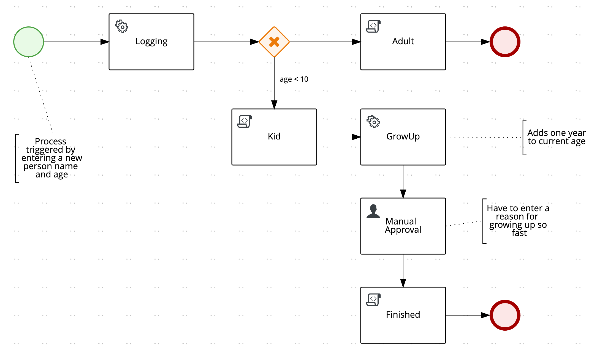

# quarkus-kogito
Testing a simple process flow using Kogito and Quarkus.

The input is a Person object (just name and age).  This input is processed by a service task that just does `Logging` to console before a decision is made.

If `age < 10` a `Kid` flow is used otherwise the default is `Adult` flow, see diagram below.



`Adult` flow uses a script task to log `"This is an adult"` to the console.

The `Kid` flow will first call a `Kid` script task to write `"This is a kid"` to the console.
Then a service task `GrowUp` will automatically add one year to to the current age before it
goes to a manual task for `Manual Approval`.

The approval task needs a reason (just a text) before the flow will continue with
the `Finished` script task that just logs `"Approved, kid has grown up."` to the console.

## Running the application in dev mode
You can run your application in dev mode that enables live coding using:
```
./mvnw quarkus:dev
```

## Test the application
Trigger a new flow using [swagger-ui](http://localhost:8080/swagger-ui/) or this curl
```
curl -X POST "http://localhost:8080/onboarding" \
-H "accept: application/json" \
-H "Content-Type: application/json" \
-d "{\"person\":{\"age\":7,\"name\":\"Kid Kidson\"}}"
```

Then do any manual approvals in the included [approval web ui](http://localhost:8080) (or manually using swagger-ui).
```
http://localhost:8080/
```

## Starting VSCode to support the Kogito Editor (if it doesn't work out of the box)
If you have installed the Kogito Editor plugin in VSCode, it might not initialize correctly when opening BPMN files.

A trick is start VSCode with the following options.
```
code --args --enable-proposed-api kiegroup.vscode-extension-pack-kogito-kie-editors
```

